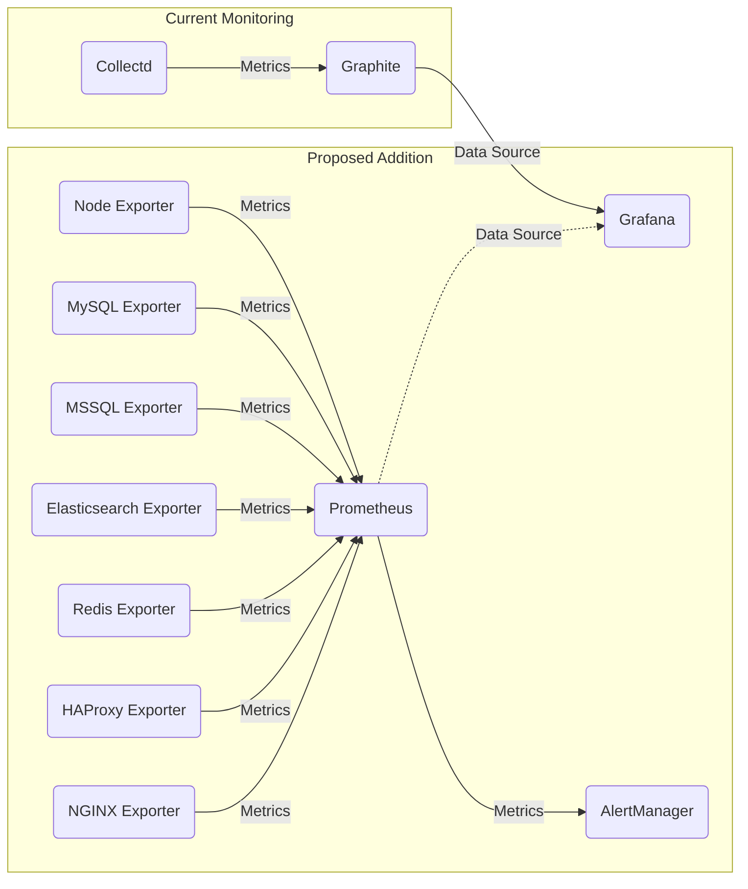

```mermaid
graph LR 

subgraph Proposed Addition
id2(Prometheus)-. Data Source .->r(Grafana)
id2--Metrics-->id3(AlertManager)
ex1(Node Exporter)--Metrics-->id2
ex2(MySQL Exporter)--Metrics-->id2
ex3(MSSQL Exporter)--Metrics-->id2
ex4(Elasticsearch Exporter)--Metrics-->id2
ex5(Redis Exporter)--Metrics-->id2
ex6(HAProxy Exporter)--Metrics-->id2
ex7(NGINX Exporter)--Metrics-->id2
end
subgraph Current Monitoring
id1(Collectd)--Metrics -->g(Graphite)--Data Source -->r
end
```

```
```